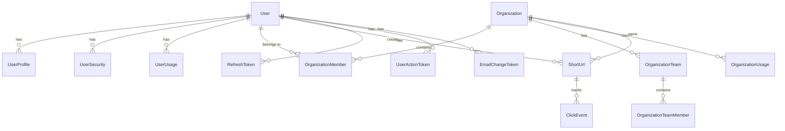

# Shortly - Link Managment System

**A Full stack URL shorter management system with advanced organization management, analytics, and team collaboration features.**

---

## 📋 Table of Contents

| Section | Description |
|---------|-------------|
| [🌟 Overview](#-overview) | Project introduction and key highlights |
| [✨ Features](#-features) | Comprehensive feature breakdown |
| [🏗️ Architecture](#️-architecture) | Clean Architecture implementation |
| [🛠️ Tech Stack](#️-tech-stack) | Technologies and frameworks |
| [📊 Database Schema](#-database-schema) | Entity relationships and structure |
| [📚 API Documentation](#-api-documentation) | Comprehensive API reference |
| [🚀 Getting Started](#-getting-started) | Development setup guide |
| [🐳 Docker Setup](#-docker-setup) | Containerized deployment |
| [📧 SMTP Configuration](#-smtp-configuration) | Email notification setup |
| [🔒 Security](#-security) | Security implementations |
| [⚡ Performance](#-performance) | Performance optimizations |
| [📄 License](#-license) | License information |

---

## 🌟 Overview

**Shortly** is a comprehensive, enterprise-grade URL shortening service built with Clean Architecture principles. It goes beyond simple URL shortening to provide a complete platform for organizations to manage their links, collaborate in teams, track detailed analytics, and maintain security at scale.

### Key Highlights
- 🏢 **Multi-Tenant Organization Management** - Complete organization structure with teams and roles
- 🔐 **Advanced Security** - Permission-based authorization, 2FA, account security
- 📊 **Comprehensive Analytics** - Real-time click tracking with geolocation and traffic analysis
- 👥 **Team Collaboration** - Invitation system, role management, and team-based URL organization
- 🔄 **Background Processing** - Quartz.NET scheduled jobs and background workers
- 📧 **Email System** - Template-based notifications with queue processing
- 🚀 **Bulk Operations** - Efficient bulk URL creation and management
- 📈 **Usage Tracking** - Subscription plans and quota management
- 🔍 **Advanced Search** - Powerful search capabilities across all entities
- 🛡️ **Audit Logging** - Comprehensive activity tracking and security auditing

---

## ✨ Features

### 🔗 URL Management
- **Smart URL Shortening** - Generate unique, memorable short codes with collision detection
- **Custom Short Codes** - User-defined aliases with availability checking  
- **Bulk Operations** - Create, update, and manage thousands of URLs simultaneously
- **URL Validation** - Comprehensive security checks and malware detection
- **Expiration Management** - Flexible expiration dates with automatic cleanup
- **Password Protection** - Secure URLs with custom password requirements
- **QR Code Generation** - Automatic QR code creation for mobile sharing

### 🏢 Organization Management
- **Multi-Tenant Architecture** - Complete organization isolation and management
- **Team Structure** - Hierarchical team organization with managers and members
- **Invitation System** - Secure email-based invitations with expiration
- **Role-Based Access** - Granular permissions for different user roles
- **Organization Analytics** - Aggregate statistics across all organization URLs
- **Usage Quotas** - Flexible subscription plans with usage tracking
- **Ownership Transfer** - Seamless organization ownership transitions

### 👥 User & Security Management
- **Advanced Authentication** - JWT tokens with refresh token rotation
- **Two-Factor Authentication** - TOTP-based 2FA for enhanced security
- **Account Security** - Password policies, account locking, security events
- **User Profiles** - Comprehensive user profile management
- **Audit Logging** - Complete activity tracking for security and compliance
- **Session Management** - Secure session handling with automatic cleanup

### 📊 Analytics & Tracking
- **Real-Time Click Tracking** - Immediate click event processing
- **Geographic Analytics** - Country and city-level location tracking
- **Traffic Source Analysis** - Referrer and campaign tracking
- **User Agent Parsing** - Device, browser, and OS identification
- **Time-Series Analytics** - Historical data with customizable date ranges
- **Performance Metrics** - URL performance comparison and ranking
- **Export Capabilities** - Data export in multiple formats (CSV, JSON, Excel)

### 📧 Communication System
- **Template-Based Emails** - Professional email templates for all communications
- **Background Processing** - Queue-based email delivery system
- **Multi-Provider Support** - SMTP, SendGrid, and other email providers
- **Notification Preferences** - User-configurable notification settings
- **Email Verification** - Secure email address validation workflow
- **Delivery Tracking** - Monitor email delivery status and failures

### 🔧 Administrative Features
- **Admin Dashboard** - Comprehensive system administration interface
- **User Administration** - Bulk user operations and account management
- **System Monitoring** - Performance metrics, and system status
- **Configuration Management** - Runtime configuration updates
- **Database Administration** - Migration management and data maintenance
- **Security Monitoring** - Real-time security event tracking and alerting

---

## 🏗️ Architecture

Shortly implements **Clean Architecture** with Domain-Driven Design principles:

```
📁 Shortly/
├── 🌐 Shortly.API/             # Presentation Layer
│   ├── Controllers/             # API Controllers (20+ controllers)
│   │   ├── Base/                    # Base controller with common functionality
│   │   ├── Auth/                    # Authentication endpoints
│   │   ├── Organization/            # Organization management
│   │   ├── ShortUrl/                # URL management
│   │   ├── Analytics/               # Analytics and reporting
│   │   └── Admin/                   # Administrative functions
│   ├── Authentication/           # JWT authentication context
│   ├── Authorization/            # Permission-based authorization
│   ├── Middleware/               # Custom middleware (exception handling)
│   └── HTMLTemplates/            # HTML templates for forms
│
├── 💼 Shortly.Core/                 # Application Layer
│   ├── Services/                      # Business logic services
│   │   ├── Authentication/              # Auth and account services
│   │   ├── UrlManagement/               # URL operations
│   │   ├── OrganizationManagement/      # Organization services
│   │   ├── ClickTracking/               # Analytics services
│   │   ├── Email/                       # Email services
│   │   └── UserManagement/              # User administration
│   ├── DTOs/                         # Data Transfer Objects (100+ DTOs)
│   ├── Validators/                   # FluentValidation rules
│   ├── Mappers/                      # Entity-DTO mapping
│   ├── Exceptions/                   # Custom exceptions hierarchy
│   └── Extensions/                   # Utility extensions
│
├── 🏛️ Shortly.Domain/          # Domain Layer
│   ├── Entities/                 # Domain entities (19 entities)
│   │   ├── User & Security          # User, UserProfile, UserSecurity
│   │   ├── Organizations            # Organization, Team, Member
│   │   ├── URLs                     # ShortUrl, ClickEvent
│   │   ├── Tokens                   # RefreshToken, ActionTokens
│   │   └── Subscriptions            # SubscriptionPlan, Usage
│   ├── Enums/                    # Domain enumerations
│   └── Configuration/            # Domain configuration
│
└── 🔧 Shortly.Infrastructure/   # Infrastructure Layer
    ├── DbContexts/                # Entity Framework context
    ├── Repositories/              # Data access implementations
    ├── BackgroundServices/        # Background workers
    ├── ScheduledJobs/             # Quartz.NET jobs
    └── Services/                  # External service implementations
```

### Architectural Benefits
- **Separation of Concerns** - Each layer has distinct responsibilities
- **Testability** - Comprehensive unit and integration testing support
- **Maintainability** - Clear boundaries and well-defined interfaces
- **Scalability** - Horizontal scaling capabilities with microservices readiness
- **Domain Focus** - Business logic isolated from technical concerns

---

## 🛠️ Tech Stack

### Core Framework
- **ASP.NET Core 8.0** - Modern, cross-platform web framework
- **Entity Framework Core 9.0** - Advanced ORM with SQL Server support
- **C# 12** - Latest language features and performance improvements

### Authentication & Security
- **JWT Bearer Authentication** - Stateless token-based authentication
- **BCrypt.Net-Next 4.0.3** - Secure password hashing
- **Microsoft.IdentityModel.Tokens** - JWT token handling
- **FluentValidation 11.3.1** - Elegant model validation

### Background Processing
- **Quartz.NET 3.15.0** - Enterprise job scheduling and background tasks
- **ASP.NET Core Hosted Services** - Background worker services
- **Queue-based Processing** - Scalable background job processing

### Database & Persistence
- **SQL Server** - Enterprise-grade relational database
- **Entity Framework Core Tools** - Database migrations and scaffolding
- **Connection Pooling** - Optimized database connection management

### Performance & Monitoring
- **MethodTimer.Fody 3.2.3** - Automatic method execution timing
- **Custom Middleware** - Request/response logging and metrics

### Development & Documentation
- **Swashbuckle.AspNetCore 9.0.3** - OpenAPI/Swagger documentation
- **User Secrets** - Secure development configuration
- **Docker & Docker Compose** - Containerization and orchestration

---

## 📊 Database Schema

### ER Diagram


### Database Schema


---

## 📚 API Documentation

Check out the API documnetation [here](https://abdelrahmantaymour.github.io/Shortly/index.html)

---

## 🚀 Getting Started

### Prerequisites
- [.NET 8 SDK](https://dotnet.microsoft.com/download/dotnet/8.0)
- [SQL Server 2019+](https://www.microsoft.com/en-us/sql-server)
- [Visual Studio 2022](https://visualstudio.microsoft.com/) or [Rider](https://www.jetbrains.com/rider/)
- [Git](https://git-scm.com/)

### 📥 Clone the Repository
```bash
git clone https://github.com/AbdelrahmanTaymour/Shortly.git
cd Shortly
```

### 🔧 Configure User Secrets
```bash
cd Shortly.API

# Create user-secrets
dotnet user-secrets init

# JWT Configuration
dotnet user-secrets set "TokenSettings:Key" "your-super-secret-jwt-key-at-least-32-characters-long-for-security"

# Database Connection
dotnet user-secrets set "ConnectionStrings:ConnectionString" "Server=localhost;Database=ShortlyDb;Trusted_Connection=true;TrustServerCertificate=True;"

# Email Configuration (Gmail example)
dotnet user-secrets set "EmailSettings:Smtp:Username" "your-email@gmail.com"
dotnet user-secrets set "EmailSettings:Smtp:Password" "your-app-specific-password"
dotnet user-secrets set "EmailSettings:From:Email" "your-email@gmail.com"
dotnet user-secrets set "EmailSettings:From:Name" "Shortly Team"
```

### 🗄️ Database Setup
```bash
# Install EF Core tools globally (if not installed)
dotnet tool install --global dotnet-ef

# Verify EF tools installation
dotnet ef --version

# Create database migration
dotnet ef migrations add InitialCreate --project Shortly.Infrastructure --startup-project Shortly.API

# Apply migration to database
dotnet ef database update --project Shortly.Infrastructure --startup-project Shortly.API
```

### 📦 Install Dependencies
```bash
# Restore all NuGet packages
dotnet restore

# Build the solution
dotnet build
```

### 🚀 Run the Application
```bash
# Run the API project
dotnet run --project Shortly.API
```

### 🌐 Access the Application
- **API Base URL:** `https://localhost:7001` or `http://localhost:5000`
- **Swagger Documentation:** `https://localhost:7001/swagger`

---

## 🐳 Docker Setup

### Prerequisites
- [Docker Desktop](https://www.docker.com/products/docker-desktop/)

### 🔧 Environment Configuration

1. **Copy the environment template:**
   ```bash
   cp .env.template .env
   ```

2. **Update the `.env` file:**
   ```env
   # Database Configuration
   DB_PASSWORD=[ur-db-password]

   # JWT Configuration
   JWT_KEY=[your-super-secret-jwt-key-at-least-32-characters-long-for-security]

   # Email Configuration
   EMAIL_USERNAME=your-email@gmail.com
   EMAIL_PASSWORD=your-app-specific-password

   # Connection String
   CONNECTION_STRING=Server=sqlserver;Database=ShortlyDb;User Id=[sa];Password=[ur-strong-password];TrustServerCertificate=True;
   ```

### 🐳 Run with Docker Compose

```bash
# Start all services (API + SQL Server + Background Workers)
docker-compose up -d

# View logs for all services
docker-compose logs -f

# View logs for specific service
docker-compose logs -f shortly-api

# Stop all services
docker-compose down

# Stop and remove all data (⚠️ This will delete the database)
docker-compose down -v
```

### 🔄 Development with Docker

```bash
# Rebuild after code changes
docker-compose up --build -d

# View running containers
docker ps

# Access API container shell
docker exec -it shortly-api bash

# Access SQL Server container
docker exec -it shortly-sqlserver /opt/mssql-tools/bin/sqlcmd -S localhost -U [sa] -P [You-db-password]
```

### 🌐 Docker URLs
- **API:** http://localhost:5001
- **Swagger:** http://localhost:5001/swagger

---

## 📧 SMTP Configuration

### Gmail App Password Setup

1. **Enable 2-Factor Authentication:**
   - Go to [Google Account Security](https://myaccount.google.com/security)
   - Enable "2-Step Verification"

2. **Generate App Password:**
   - Go to "2-Step Verification" settings
   - Click "App passwords"
   - Select "Mail" and "Other"
   - Name it "Shortly API"
   - Copy the 16-character password

3. **Configure in User Secrets:**
   ```bash
   dotnet user-secrets set "EmailSettings:Smtp:Username" "your-email@gmail.com"
   dotnet user-secrets set "EmailSettings:Smtp:Password" "abcd efgh ijkl mnop"
   ```

4. **Or in Docker .env:**
   ```env
   EMAIL_USERNAME=your-email@gmail.com
   EMAIL_PASSWORD=abcdefghijklmnop
   ```

### Email Templates
The system includes professional email templates for:
- **Welcome & Registration** - User onboarding emails
- **Email Verification** - Account activation
- **Password Reset** - Secure password recovery
- **Organization Invitations** - Team member invitations
- **Usage Notifications** - Quota and usage alerts
- **Security Alerts** - Login and security notifications

---

## 🔒 Security

### Authentication & Authorization
- **JWT Bearer Tokens** - Secure stateless authentication
- **Refresh Token Rotation** - Enhanced security with token rotation
- **Role-Based Access Control** - Granular permission system
- **Two-Factor Authentication** - TOTP-based 2FA support
- **Permission-Based Authorization** - Fine-grained access control

### Data Protection
- **Password Security** - BCrypt hashing with configurable rounds
- **Input Validation** - Comprehensive FluentValidation rules
- **SQL Injection Prevention** - EF Core parameterized queries
- **XSS Protection** - Input sanitization and encoding
- **CSRF Protection** - Anti-forgery tokens

### Security Monitoring
- **Audit Logging** - Comprehensive activity tracking
- **Failed Login Tracking** - Brute force attack detection
- **Account Locking** - Automatic account protection
- **Security Events** - Real-time security event logging
- **Session Management** - Secure session handling

### Infrastructure Security
- **HTTPS Enforcement** - TLS encryption for all communications
- **CORS Configuration** - Secure cross-origin requests
- **Rate Limiting** - API abuse prevention
- **URL Validation** - Malicious URL detection
- **Content Security Policy** - XSS and injection protection

---

## ⚡ Performance

### Database Optimizations
- **Strategic Indexing** - Optimized database indexes
- **Query Optimization** - Efficient EF Core queries
- **Connection Pooling** - Database connection optimization
- **Async Operations** - Non-blocking I/O operations
- **Bulk Operations** - Efficient batch processing

### Caching Strategy
- **Response Caching** - HTTP response caching
- **Memory Caching** - In-memory data caching
- **Query Result Caching** - Database query caching
- **Static Content Caching** - CDN-ready static assets

### Background Processing
- **Queue-Based Processing** - Scalable background jobs
- **Batch Processing** - Efficient bulk operations
- **Async Email Delivery** - Non-blocking notifications
- **Scheduled Jobs** - Quartz.NET job scheduling

### Monitoring & Metrics
- **Method Timing** - Execution time monitoring
- **Performance Counters** - Real-time metrics
- **Request Logging** - Comprehensive request tracking

---

## 📞 Contact & Support

**LinkedIn** - [Abdelrahman Taymour](https://linkedin.com/in/ataymour)

---

## 📄 License

This project is licensed under the MIT License - see the [LICENSE](LICENSE) file for details.
